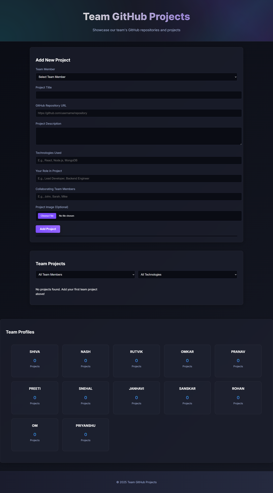

# 🔥 Team GitHub Streak Viewer 

This is a collaborative web project that allows team members to **submit their GitHub profiles** and **track their contribution streaks**, built with **HTML, CSS, and JavaScript**.

## 🎯 Purpose

The aim is to **encourage daily contributions** by keeping track of streaks in a visual, interactive way — and build a sense of accountability and motivation among teammates.

## 🚀 Features

- ✍️ Form to submit GitHub profile URLs
- 🔗 Display of submitted profiles with live links
- 📈 Optionally, display contribution streaks using GitHub Readme Stats API
- 💻 Built using pure HTML, CSS, JavaScript & A.I

